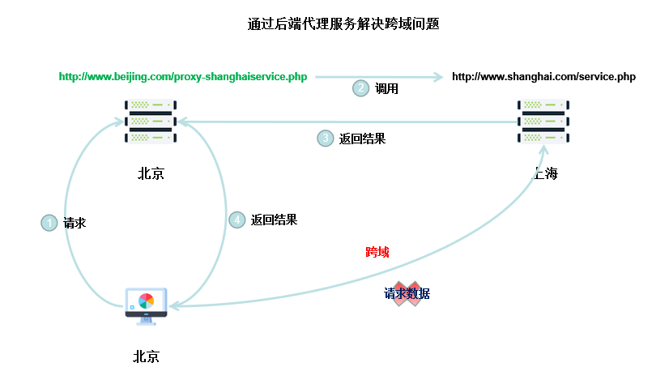

### 前言

**AJAX**:  **A**synchronous **J**avaScript **A**nd **X**ml (异步的 JavaScript 和 XML)，是一种无需重新加载整个网页的情况之下能够更新部分网页的技术。

### 网页交互方式

传统的网页交互过程：用户在页面表单上填写信息，提交给服务器处理，成功后再重新载入页面。

使用 AJAX 技术的网页交互过程：

1. 使用 HTML 和 CSS 实现页面，表达信息。
2. 使用 XMLHttpRequest 与 Web 服务器进行数据的异步交换。
3. 使用 JavaScript 操作 DOM，实现动态局部刷新。

### HTTP 协议

HTTP 是计算机通过网络进行通信的规则，是一种无状态协议。

> 无状态是指建立的连接不是持久的，服务端不需要保留与连接相关的信息。

#### HTTP 请求

##### HTTP 请求的组成部分

* HTTP **请求的方法或动作**，比如是 GET 请求或 POST 请求。
* 正在**请求的 URL**，浏览器需要知道请求地址。
* **请求头**，包含一些客户端环境信息，身份信息。
* **请求体**，即请求正文，请求正文中可以包含客户提交的查询字符串信息，表单信息等。

> 请求头与请求体通常相隔一个空行。

##### HTTP 请求过程

一个完整的 HTTP 请求过程，通常有下面 7 个步骤：

1. **建立 TCP 连接**。
2. Web 浏览器向 Web 服务器**发送请求**命令。
3. Web 浏览器向 Web 服务器**发送请求头**信息。
4. Web 服务器**应答**。
5. Web 服务器**发送应答头**信息。
6. Web 服务器向浏览器**发送数据**。
7. Web 服务器**关闭 TCP 连接**。

##### Get 与 Post 区别

GET(默认是 Get 方法) : 

* 一般用于信息获取。
* 使用 URL 传递参数(在 URL 中可以查看传递的参数)。
* 对发送信息的数量也有限制，一般在2000个字符左右。

POST :

* 一般用于修改服务器上的资源。
* 对发送的信息数量无限制。

> 幂等性：按某个条件查询一次和查询一万次的结果都是相等的。

#### HTTP 响应

##### HTTP 响应组成部分

HTTP 响应由3部分组成。

* 1个数字和文字组成的**状态码**，用来显示请求是成功还是失败。
* **响应头**，响应头和请求头一样包含许多有用的信息，例如服务器类型、日期类型、内容类型和长度等。
* **响应体**，也就是响应正文。

##### HTTP 状态码

HTTP 状态码由3位数字组成，其中首位数字定义了状态码的类型：

1XX：**信息类**，表示收到 Web 浏览器请求，正在进一步的处理。

2XX：**成功**，表示用户请求被正确接收、理解和处理，如：200，OK。

3XX：**重定向**，表示请求没有成功，客户必须采取进一步的动作。

4XX：**客户端错误**，表示客户端的请求有错误，例如：404 NOT Found，意味着请求所引用的文档不存在。

5XX：**服务器错误**，表示服务器不能完成对请求的处理，如：500。

### XMLHttpRequest 对象

XMLHttpRequest 对象简称为 XHR 对象。

其创建过程如下：

```javascript
var request;
if(window.XMLHttpRequest){
    request = new XMLHttpRequest();	//主流浏览器 Firefox,IE7,Chrome...
}else{
    request = new ActiveXObject('Microsoft.XMLHTTP');	//IE6,IE5
}
```

### XMLHttpRequest 对象的使用

请求的发送与响应都涉及 XMLHttpRequest 这个对象。

#### 发送请求

```javascript
/*
	参数说明
	method: 指定当前方法是 GET 或者 POST, 可选值： 'GET' | 'POST',
	url: 请求的地址
	async: 指定当前请求是同步的还是异步的，是一个 Boolean 类型的参数
*/
open(method, url, async);

/*
	send 中的参数是要发往服务器上的数据
	如：name=mike&age=23 
*/
send(string);
```

> 使用 POST 请求一定要记得设置 Content-Type，在请求头中设置。

#### 取得响应

借助 XMLHttpRequest 对象，可以获取响应中的一些关键内容，如下：

* responseText：获得字符串形式的响应数据。
* responseXML：获得 XML 形式的响应数据。
* status  和 statusText：以数字和文本形式返回 HTTP 状态码。
* getAllResponseHeader()：获取所有的响应报头。
* getResponseHeader()：查询响应中某个字段的值。

此外，浏览器端还需要监听一个非常重要的属性 readyState 的值。。

0：请求未初始化， open 还没有调用。

1：服务器端连接已建立，open 已经调用。

2：请求已接收，也就是接收到请求头信息了。

3：请求处理中，也就是接收到了响应主体了。

4：请求已完成，且响应已就绪，也就是响应完成了。

### JSON 数据

对于 Json 格式的数据，键值对中的键需要使用双引号表示，值可以不用 JSON 解析，可以使用 eval 及 JSON.parse 方法去解析。但有一点值得注意的是：使用 eval 方法时，该方法不会去解析 JSON 字符串中的合法性，如果字符串中定义了方法，使用 eval 解析，该方法会被执行，存在一定的安全隐患。

### 跨域

#### 域名组成

| http:// |  www   | abc.com |  :   |  8080  |  /   | scripts/jQuery.js |
| :-----: | :----: | :-----: | :--: | :----: | :--: | :---------------: |
|  协议   | 子域名 | 主域名  |      | 端口号 |      |   请求资源地址    |

> 当协议、子域名、主域名、端口号中任意一个不同，都算做不同域。

**不同域之间相互请求资源，即为跨域。**

> eg : http://www.abc.com/index.html 请求 http://efq.com/service.php

#### 一种跨域处理方案

下面介绍一种通过后端代理服务解决的跨域处理方案。

场景：某台位于北京的电脑通过浏览器请求上海服务器的服务。由于跨域问题无法直接获取数据。



上图背后的过程如下：

1. 存在着两台 Web 服务器，域名如下:

   > 北京服务器：www.beijing.com
   >
   > 上海服务器：www.shanghai.com

2. 北京的 Web 服务器创建一个代理服务(www.beijing.com/proxy-shanghaiservice.php) 来调用上海服务器(www.shanghai.com/service.php)的服务。

3. 北京 PC 浏览器与同域名的北京 Web 服务端进行网络请求，北京服务器收到请求后，通过代理服务调用上海的服务，上海服务器返回数据给北京服务器，北京服务器再将接收到的数据发给 PC 端浏览器。通过这种方式，前端调用北京同域名的服务就和调用上海的服务效果等同了。

### 参考

* [Ajax - Getting Started - MDN](<https://developer.mozilla.org/en-US/docs/Web/Guide/AJAX/Getting_Started>)

* [Ajax 全接触](<https://www.imooc.com/learn/250>)

