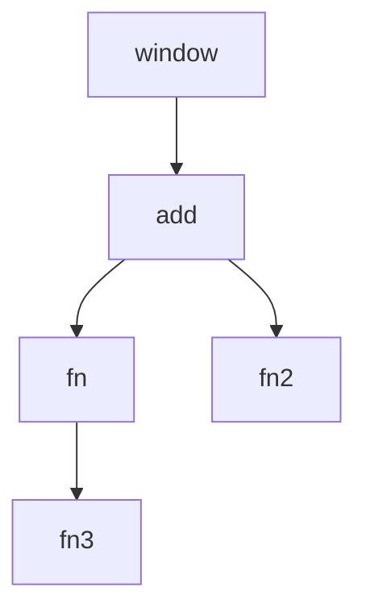

# 引言

在 JavaScript 中，函数可以被调用，也可以当做参数，还可以当做返回值输出。

# 对象

在 JavaScript 中，对象是任意值的集合。

> JavaScript 中的值有 '123'，true，[]，function 等，分为基本类型和引用类型两种。

## 对象创建

* 字面量方式：使用 `{}` 来声明一个对象。

```javascript
var cat = {
    'name': 'Tom',					//字符串
    'age': 4,						//数字
    'family': ['father', 'mom'],	//数组
    'speak': function(){			//function 类型
        console.log('喵喵~');
    },
    'friend':{						//对象
        'name': 'Jerry',
        'age': 4
    }
};
```

* 构造函数方式

```javascript
var cat = new Object();
```

* ECMAScript 提供的方式

```javascript
Object.create();
```

> 有些老版本浏览器不支持这种方式，存在兼容性问题。

## 对象使用

### 属性访问

```javascript
//=>属性赋值
cat.name = 'Tim';
cat['name']= 'Tim';

//=>创建属性并赋值
cat.type = '加菲猫';
cat['age'] = 12;

console.log(cat.name);	  //=> Tim
console.log(cat['name']); //=> Tim
console.log(cat.type);	  //=> 加菲猫

//删除属性
delete cat.type
console.log(cat.type);	  //=> undefined
```

> line 3 - 4 : 若对象原来没有该属性，则创建该属性并赋值。否则，则直接对该属性进行赋值。

### 检测对象是否有某属性，使用 `in` 

```javascript
console.log('name' in cat);
```

> 对象中若包含该属性，结果为 true。否则为 false。

### 对象枚举，使用 `for-in` 循环

```javascript
for(var p in cat){
    console.log(p);	    //=> p 是属性名
    console.log(cat.p);	//=> 输出属性值
    console.log(cat[p]);//=> 输出属性值
}
```

> 使用中括号属性访问对象属性的方式更加强大，因为中括号内可以使用具有返回值的表达式。如：

```javascript
console.log(cat['n' + 'ame']);
```

# 函数

## 函数含义

什么是函数？一次封装，四处使用，也可以理解为一次定义，四处调用。

常见例子：

```javascript
//定义
function add(num1, num2) {
    return num1 + num2;
}

//调用
add(1, 2);
add(1, 3);
```

> function 是关键字，用于告诉 js 解析器，当前定义的是函数。
>
> add 是函数名，类似于变量。函数存放在内存中，通过函数名去访问函数体内容。
>
> 花括号内的是函数的作用域。

### 匿名函数

匿名函数是函数名省略的函数。

```javascript
window.onload = function (){}
```

### 函数定义和调用时发生了什么？

```javascript
<script>
    function add(num1, num2) {
        var result = num1 + num2;
        return result;
    }

    add(1, 1);
    add(1, 2);
    add(1, 3);
</script>
```

> 首先，存在全局作用域 window。
>
> line 2 ~ 5：在全局作用域的变量对象 window 上添加了一个方法 add。
>
> line 7: 当 add 函数被调用后，会在 add 下面创建一个局部作用域。在这个局部作用域中有三个局部变量：num1, num2, result。接着，函数实参就会对函数形参进行赋值。num1 = 1; num2 = 1。num1 与 num2 相加之后，result 的结果为 2。最后，结果被返回。函数执行完毕后，add 创建的函数局部作用域会被销毁，里面所有的局部变量也会被销毁。
>
> 注意：add 方法不会被销毁，因为它属于全局对象 window 的方法。所以，line 8~9 仍然可以继续调用此函数。每次的函数调用都会创建一个新的函数作用域，函数执行完毕后销毁已创建的函数作用域。

总结：函数定义时会被预解析，被调用时会创建属于函数自己的作用域，当函数执行完毕，函数作用域会被销毁。

### 为什么使用函数

函数作用：

1. 复用代码，复用自己或复用他人的方法

   如：`jQuery` 中的 `$('p')`。`$` 就是一个函数名。

2. 统一修改和维护

3. **增加程序可读性**

   版本一

   ```javascript
   function doTings(month) {
       if(month >= 3 && month <= 5){
           //踏春   
       }else if(month >= 6 && month <= 8){
           //游泳
       }else if(month >= 9 && month <= 12){
           //秋收
       }else{
           //睡觉
       }
   }
   ```

   > 存在问题：暴露过多细节，比如：「判断春夏秋冬」的细节

   版本二

   ```javascript
   function doTings(month) {
       if(isSpring(month)){
           //踏春   
       }else if(isSummer(month)){
           //游泳
       }else if(isAutumn(month)){
           //秋收
       }else{
           //睡觉
       }
   }
   
   //使用函数封装细节
   function isSpring(month){
       return month >= 3 && month <= 5;
   }
   
   function isSummer(month){
       return month >= 6 && month <= 8;
   }
   
   function isAutumn(month){
       return month >= 9 && month <= 12;
   }
   ```

   > 通过函数来封装一些细节，使得程序更加易读。
   >
   > 读源码的建议：通读函数，从函数名来理解功能实现，不要花过多时间去纠结于函数的实现细节。

   #### 何时使用函数

   出现以下情况，考虑使用函数进行封装。
   
1. 程序中存在过多相似的代码段的时候
   2. 程序中暴露过多的细节的时候。

## 函数本质

函数具有 **二象性**：

1. **函数是函数，是可以被调用的函数**。

2. **函数是对象 **。

   > 这是 JavaScript 中一个比较独特的地方，也是大部分主流语言不具备的特性。

### 函数定义方式

由于函数是对象，所以函数的定义方式与对象类似。

* 字面量方式：

```javascript
function add(num1, num2){
    //xxxx
}
```

* 构造函数方式

```javascript
new Function('num1', 'num2', ...);
```

函数也可以像对象一样添加属性和方法

```javascript
function add(num1, num2){
    return num1 + num2;
}
add.sex = 'male';
add.setSex = function(sex){
    this.sex = sex;
}
console.log(add.sex); //=>male
add.setSex('female');
console.log(add.sex); //=>female
console.log(add(1, 2));//=> 3
```

> 此做法可以让函数缓存一些值。例如：在上述例子中每次缓存上一次的加法结果。

### 函数作为数据值使用

由于函数是对象，所以它也是存放在内存中的。变量需要通过变量名进行访问，函数需要通过函数名进行访问。

```javascript
var person = {};
var add = function () {
  return 1;  
};

add();
console.log(add());	//=>1
console.log(add);	//=> function () { return 1; };

function add() {
   return 1;
}
```

> add 是指向匿名函数的引用地址，所以通过 add 引用可以访问到函数并进行调用。
>
> add 就是函数体，函数名也是函数本体。
>
> line 2 ~ 4 与 line 10 ~ 12 函数定义本质上是相同的，都能借助 add 来访问到函数本体。侧面反映：函数是对象，add 是函数(对象)的引用。

数组中可以存放函数，对象中也可以存放函数。

```javascript
[{}, function () {}];

{
    family: {},
    setName: function (argument) {
        //body
    }
}
```

函数也可作为参数使用。

```javascript
//方式一
setTimeout(function () {
    console.log(1);
},1000);

//方式二
setTimeout(fn, 1000);
function fn() {
    console.log(1);
}
```

> fn() 是指函数调用， fn 是指函数本体。

函数作为返回值。

```javascript
function fn () {
    return function (){
      console.log(1);  
    };
}

var newFn = fn();
newFn();	//=>1
```

> line 7 : fn() 函数调用后返回的是一个新的函数引用。并将该函数引用赋值给 newFn 变量。
>
> line 8 :  newFn() 调用后执行 line 7 返回的函数引用。它等价于 fn()();

# 函数的三种定义方式与区别

## 字面量

字面量方式又分为两种：function 声明 和  var 赋值表达式声明。

## function 声明

```javascript
function add() {}
add();
```

## var 赋值表达式

```javascript
var add = function (argument) {};
add();
```

## 奇怪的写法

```javascript
var add = function fn(argument) {
    add();	//可以调用
    fn();	//可以调用
};

add(); //可以调用
```

> 外部只能调用 add，不能调用 fn。因为 fn 是函数局部变量。而 fn 函数内部依据作用域链可以访问到外部 add 函数。

## 构造函数

```javascript
var add = new Function('num1','num2','return num1 + num2');
add(1, 2);
```

> 参数及函数体只能使用字符串形式。

## 区别

字面量声明方式直观，简洁，方便书写。

构造函数方式笨重，复杂，函数体复杂时写起来比较臃肿。由于参数是字符串形式，所以当构造函数进行实例化时，需要将字符串解析成参数或者是函数体内容，再实例化构造函数。

### 预解析的区别

```javascript
console.log(add());
function add() {
    return 1;
}
console.log(add()));
```

> line 1 / 5 ： 均可正常输出。原因：由于 add 会被当做 function 被正常预解析，所以两行均可正常输出。

```javascript
console.log(add());
var add = function () {
    return 1;
}
console.log(add()));
```

> line 1 : 报错。这时因为预解析时，使用 var 声明的变量都会被赋值成 undefined，当执行到 line 1 时， add 未声明，就会报错。
>
> line 5 :  正常输出。 

## 函数定义的位置

### 全局作用域

```javascript
add();
function add() {
    add();
}
add();
```

> add 函数属于全局作用域上的函数，line 1/3/5 均可正常调用。

### 函数作用域

```javascript
fn();
function add() {
    fn();
    function fn(){
        fn();
        function fn3(){
            fn();
        }
        fn();
    }
    function fn2() {
        fn();
    }
}
fn();
```

> line 1 / 15 : 报错，不可正常输出。外部函数不能访问局部函数的方法或者变量。而局部变量函数可以访问全局作用域上的函数。

画一张作用域链图示，帮助理解和分析。



> fn 内部访问 fn 时，fn 与 fn3 同属于 fn 的内部，找不到相关方法就会沿着作用域链往上查找 fn。

### JavaScript 无块级作用域

funcion 声明函数方式

```javascript
if(true) {
    function add(argument) {}
} else {
    function subtract(argument) {}
}
```

> 因为 JavaScript 中无块级作用域，使用 if/else 不会形成块级作用域，只会被当做是代码块。在预解析时，add 与 subtract 都会被当做 function 预解析。

函数赋值表达式方式

```javascript
if(true) {
    var add = function (argument) {}
}else {
    var subtract = function (argument){}
}
```

> 在预解析后，add 与 subtract 变量都会被赋值为 undefine。当代码执行到 if/else 时，若条件为真，则 add 被赋值，指向一个匿名函数。这样，就解决了 function 按条件声明函数的弊端。

### 对象中的函数

```javascript
var person = {
    name: 'xm',
    setSex: function (sex) {
        this.sex = sex;
    }
};
person.setName = function (name) {
    this.name = name;
}
person.setName('xh');
```

> 对象中的函数调用，使用 对象名.函数名 的方式来进行调用。

# 函数的调用

## 普通函数调用

```javascript
function add() {}
add();
```

## 匿名函数调用

* 将匿名函数赋值给一个变量，等价于命名函数

```javascript
var add = function (){
    
};
add();
```

* 不让函数关键字 `function` 在开头，因为这样会被 js 解析器当做是 `function` 声明。函数的调用本质上是 **函数本体()** 的方式来执行。

```javascript
//调用方式一
(function(){
    
})();

//调用方式二
(function(){
    
}());

//调用方式三，! + - ~ 都是 JavaScript 中合法的字符，一元运算符
!+-~function (){
    console.log(1);
}();

console.log(function(){
    return 1;
});	//=> 1
```

> 其本质上都是避免 function 关键字出现在函数调用开头。
>
> line 16~18 ：正常输出 1， 因为 function 不在开头，所以变成了匿名函数自执行。

## 递归调用

阶乘计算

```javascript
/*
    5! = 5 * 4 * 3 * 2 * 1;
    4! = 4 * 3 * 2 * 1;
    5! = 5 * 4!;
*/

function factorial(num) {
    if(num <= 1) return 1;
    return num * factorial(num - 1);
}
```

> 递归在某种程度上可以看成循环。

## 方法的调用

### 对象上的方法的调用

```javascript
var opertaion = {
    add: function(num1, num2){
        return num1 + num2;
    },
    subtract: function(num1, num2){
        return num1 - num2;
    }
};
operation.add(num1, num2);
```

> 调用方式：对象.方法名();

### 浏览器上的对象的方法调用

```javascript
document.onclick = function() {
  console.log('你点击了文档！');  
};
document.onclick();
```

> 这里，对浏览器的 document 对象的 onclick 属性进行赋值，将它变成一个方法。当用户点击 document 时，浏览器将会调用 document.onclick()。此外也可以通过 document.onclick(); 来模拟点击。

### 特殊的方法调用

```javascript
var operation = {
    add: function(num1, num2) {
        return num1 + num2;
    },
    subtract: function(num1, num2) {
        return num1 + num2;
    },
    '@': function (){
        console.log('@')
    }
};

console.log(operation.add(1, 2));
console.log(operation['@'](1, 2));
```

> operation 对象中的 @ 属性对应的方法名是需要添加双引号的。@ 符号是一个非法的变量名，添加双引号，将其表示为字符串。在调用时，可以通过 **对象名[属性值]** 的方式来进行调用。

### 链式调用

每个方法返回 `this` 。

```java
var operation = {
    add: function(num1, num2) {
        console.log(num1 + num2);
        return this;
    },
    subtract: function(num1, num2) {
        console.log(num1 + num2);
        return this;
    },
    '@': function (){
        console.log('@')
    }
};

console.log(operation.add(1, 2).subtract(2, 1));
```

> 弊端：当链式调用过长时，其中某一个调用出现问题会影响到后面的调用。

### 构造函数调用

构造函数使用 `new` 关键字进行调用。

```javascript
function Person() {}

Person();
var obj = new Person();
```

> line 3 是普通调用。
>
> line 4 是构造函数调用，用于实例化对象。

系统中内置的构造函数

```javascript
Object();
Array();
new Object();
new Array();
```

> line 1~2 是普通函数调用。
>
> line 3~4 是构造函数调用。

### 函数的间接调用

使用每个函数都具备的 call 与 apply 方法进行间接调用。

```javascript
var name = 'xm';
var person = {};
person.name = 'xh';
person.getName = function(){
    return this.name;
};
console.log(person.getName());	//=> 'xh'
console.log(person.getName.call(window));	//=> 'xm'
console.log(person.getName.apply(window));	//=> 'xm'
```

> call 方法与 apply 方法的第一个参数用于改变方法内的 this 指向。
>
> line 8：getName 方法内的 this 指向了 window，返回的是 window.name，结果为 xm。

call 与 apply 传参方式上的区别。

```javascript
function add(num1, num2) {
    return num1 + num2;
}
console.log(add(1, 2));
console.log(add.call(window,1, 2));
console.log(add.apply(window, [1, 2]));
```

> line 5 : call 将参数按照一一对应的方式传递。
>
> line 6 : apply 将参数按数组方式传递。

# 参数使用

## 参数类型

函数的 **形参**，相当于一个占位符。函数的 **实参**，是函数在调用时调用方传递的参数。

函数参数的传递，本质上就是 **实参向形参赋值** 的过程，也就是 **形参 = 实参** 。

### 基本类型做函数参数

```javascript
function add(num1, num2) {
    return num1 + num2;
}
add(1, 2);
```

> 当函数参数是基本类型时，参数传递的是参数值的副本。在 add 函数内部，num1 = 1，num2 = 2。

### 引用类型做函数参数

```javascript
var person = {};
function setPerson(obj) {
    obj.name = 'xm';
}
setPerson(person);
```

> 当函数参数是引用类型时，参数传递的是引用的值的副本，由于引用的值是一个地址值，在 setPerson 中，obj 与 person 指向的是同一个对象，obj 的操作也会影响到 person。

## 参数个数

### 函数参数三种情况

* 实参个数等于形参个数

  ```javascript
  function add(num1, num2) {
      return num1 + num2;
  }
  add(1, 2); //=> 3
  ```

* 实参个数小于形参个数

  ```javascript
  function add(num1, num2) {
      return num1 + num2;
  }
  add(1);
  ```

  > 在预解析后，num1 与 num2 的值都为 undefined。
  >
  > line 4：num1 的值为 1， num2 的值为 undefined，相加结果为 NaN。

* 实参个数大于形参个数，使用 arguments 来解决。

  ```javascript
  function add() {
     if(arguments.length === 0) return;
      var sum = 0;
      for(var i = 0; i < arguments.length; i++) {
          sum += arguments[i];
      }
      return sum;
  }
  add(1);	
  add(1, 2);
  add(1, 2, 3);
  add(1, 2, 3, 4);	//=>arguments[0] = 1,arguments[1] = 2...
  ```

  > arguments 是一个类数组，下标从零开始。

* 可选参数

  ```javascript
  function pow(base, power) {
      //if(!power) power = 2;
      power = power || 2;	//短路操作
      return Math.pow(base, power);
  }
  console.log(pow(3, 2));  //3的2次方9
  console.log(pow(2, 2));	 //2的2次方4
  ```

  > || 是 JavaScript 中的逻辑运算符，代表或者的意思。一般用于条件判断。
  >
  > line 3 : JavaScript 会将 power 转换成 boolean 值，如果转换结果的值为 true，则将 power 值返回。若，所有的值为 false，则返回最后一个的值。

## arguments

**arguments 结构**

```javascript
{
    '0': 0,
    '1': 1,
    '2': 2,
    length: 3
}
```

> arguments 是一个类数组，实质上是一个对象。不是真正的数组。每一个函数中都存在 arguments，它是局部的。

```javascript
function fn(name) {
    arguments[0] = '';
    console.log(name);
}
fn('xm');	//=> ''
```

> arguments[0] 和 实参是同一个东西，只是名字不同而已。

```java
function fn(name) {
    console.log(arguments);
    function fn2(){
        console.log(argments);
    }
    fn2(2);
}
fn(1);
```

> line 8 : 1。
>
> line 6 : 2。
>
> 每个函数内部都有一个 arguments 。

**arguments.callee**

arguments.callee 是指函数本身。

```javascript
function add(num1, num2) {
    alert(arguments.callee);
    return num1 + num2;
}
add();
```

> 弹窗内容就是函数本体内容。

**arguments.callee 小技巧**

```javascript
function factorial(num) {
    if(num <= 1) return 1;
    return num * arguments.callee(num - 1);
}
console.log(factorial(5));
```

> 在递归函数内部，使用 arguments.callee 替换成当前函数名。后期修改递归函数名时只需修改外部的函数名即可，不需要在内部做任何修改。但是在严格模式下，arguments.callee 不能使用。

在函数内部使用 `use strict` 严格模式的话，下面声明变量的方式就会导致报错。

```javascript
'use strict';
num = 1;	//=> 报错
```

解决方法：

```javascript
var factorial = function fn(num) {
  if(num <= 1) return 1;
  return num * fn(num - 1);
};
```

> factorical 在外部使用， fn 在函数内部使用。只需要修改 factorial 函数名即可，内部不需要修改。

**函数参数处理**

```javascript
function add(num1, num2) {
    if(arguments.length != add.length) throw new Error('请传入' + add.length + '个参数！');
    return num1 + num2;
}
add(1, 1);
```

> line 2 : arguments.length 是实际参数个数，add.length 是函数形式参数个数。
>
> ​			throw new Error() 是手动抛出错误。

## 什么可以做参数

* 无参数
* 基本数据类型：数字，字符串，布尔值，undefined，null。
* 引用类型：数组，对象，函数。

```javascript
function setPerson(obj) {
    var person = {};
    person.name = obj.name || 'xh';
}

setPerson({
    name：'xm',
    age: 18
});
```

> 当参数过多(超过3个)时，可以考虑使用对象将参数封装起来。

```javascript
setTimeout(function(){
    
},1000);
```

> 函数做参数，通常用于回调函数，不会立即执行，而是会在将来的某个时间被执行。

# 函数返回值

关键字 `return`，可用于提前结束函数或者是将数据值返回给调用方。

```javascript
alert([1, 2, 3]);
```

> alert 会将参数转换成字符串处理，所以等价于 alert([1, 2, 3].toString());

可以被当做参数的数据类型也可以当做返回值。

> 为了写出更好更优雅的函数，可以将函数作为参数传递到另一个函数中，组成一个新功能函数。
>
> 新的函数就可以具备两个功能：
>
> 1. 作为参数传递进来的函数的功能
> 2. 原接收函数作为参数的函数的功能

